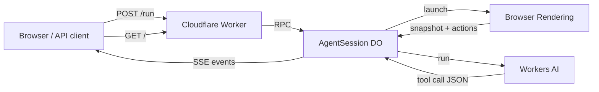

# Stateful Browser Agent

A stateful Cloudflare Worker that uses [Workers AI](https://developers.cloudflare.com/workers-ai/) (Llama 3.3 70B) and [Browser Rendering](https://developers.cloudflare.com/browser-rendering/) (Puppeteer) to accomplish natural-language goals through real page interaction. Session state is persisted in a [Durable Object](https://developers.cloudflare.com/durable-objects/) via the [Agents SDK](https://developers.cloudflare.com/agents/).

## Features

- Natural-language goals via the built-in web UI or `POST /run`
- Tool-call loop: `navigate`, `fill`, `click`, `select`, `hover`, `submit`, `done`
- Structured page snapshots with interactive element selectors for the LLM
- Server-Sent Events (SSE) streaming of step-by-step progress
- Per-session Durable Objects (Bearer token hash or `X-Session-Id`)
- Optional bearer-token auth, rate limiting, DNS-based SSRF checks, and domain allowlists

## Architecture



The Worker derives a session ID from the Bearer token or `X-Session-Id` header, then routes to an `AgentSession` Durable Object. The agent loop opens one browser page per task, validates URLs via DoH before and after navigation, asks the LLM for one tool call per turn, and feeds results back into message history until the LLM calls `done` or the step limit is reached.

## Prerequisites

- Node.js and npm
- A Cloudflare account with **Browser Rendering** and **Workers AI** enabled
- [Wrangler](https://developers.cloudflare.com/workers/wrangler/) authenticated via `wrangler login`

Both the `browser` and `ai` bindings in `wrangler.jsonc` use `"remote": true`, so local development calls Cloudflare's remote Browser Rendering and Workers AI services.

## Quick start

```bash
npm install
npm run dev      # wrangler dev — open the printed URL, use the UI at /
npm test         # vitest
npm run deploy   # wrangler deploy
npm run types    # wrangler types
```

After `npm run dev`, open `http://localhost:8787/` (Wrangler's default port), enter a goal, and click **Run**.

### Production secrets and vars

```bash
# Require Bearer auth on /run and /status
printf '%s' 'your-secret-key' | npx wrangler secret put AGENT_API_KEY

# Optional: restrict navigable domains (comma-separated suffixes)
npx wrangler vars set AGENT_ALLOWED_HOST_SUFFIXES "cloudflare.com,duckduckgo.com"

# Optional: restrict CORS to specific origins (comma-separated)
npx wrangler vars set ALLOWED_ORIGINS "https://your-app.example.com"

# Cooldown between runs per session (default 10000 ms, set in wrangler.jsonc)
npx wrangler vars set AGENT_RUN_COOLDOWN_MS "10000"
```

The demo UI stores your API key in `sessionStorage` and sends it as `Authorization: Bearer …` when configured.

### API example

```bash
curl -N -X POST https://stateful-browser-agent.example.workers.dev/run \
  -H "Authorization: Bearer YOUR_AGENT_API_KEY" \
  -H "Content-Type: application/json" \
  -d '{"goal":"Summarize Cloudflare Browser Rendering docs"}'
```

The response is a stream of SSE `data:` lines. Use `-N` with curl to disable buffering.

## API reference

| Method | Path | Description |
|--------|------|-------------|
| `GET` | `/` | Demo UI (inline HTML) |
| `POST` | `/run` | Start the agent. Body: `{ "goal": string }`. Returns `text/event-stream`. |
| `GET` | `/status` | Current Durable Object state (JSON). |
| `OPTIONS` | `/*` | CORS preflight (204). |

Auth: when `AGENT_API_KEY` is set, `/run` and `/status` require `Authorization: Bearer <key>`.

Session: each Bearer token maps to an isolated Durable Object. Without auth, pass `X-Session-Id` or fall back to `demo-session`.

Rate limit: returns `429` with `Retry-After` when `AGENT_RUN_COOLDOWN_MS` has not elapsed since the last run.

### `POST /run` request

```json
{ "goal": "Go to example.com and describe the homepage" }
```

Returns `400` if `goal` is missing, empty, or over 4096 characters. Returns `409` if a run is already in progress for the session.

### `GET /status` response

```json
{
  "goal": "…",
  "steps": [
    {
      "action": "fill \"user@example.com\" → #email",
      "observation": "…",
      "timestamp": 1718280000000,
      "toolResult": { "result": "success" }
    }
  ],
  "status": "idle | running | done | error",
  "finalSummary": "…"
}
```

### SSE event types

Each event is a JSON object on a `data:` line:

| `type` | Payload | Description |
|--------|---------|-------------|
| `start` | `{ goal }` | Agent run started |
| `plan` | `{ url }` | Inferred start URL from the goal |
| `launching` | — | Browser session starting |
| `observe` | `{ length }` | Initial page snapshot captured |
| `tool` | `{ tool, args }` | LLM chose a tool call |
| `step_result` | `{ result, message? }` | Tool execution result (`success` or `error`) |
| `done` | `{ summary }` | Task finished |
| `error` | `{ message }` | Hard stop (unsafe URL, blocked navigation, etc.) |

## Tool protocol

The LLM responds with exactly one JSON tool call per turn. Selectors must come from the `=== Interactive Elements ===` section of the page snapshot.

| Tool | Purpose | Re-snapshot after action |
|------|---------|--------------------------|
| `navigate` | Go to an HTTPS URL | Always |
| `fill` | Type into an input | No (unless followed by click/hover with `reobserve`) |
| `click` | Click an element | If `reobserve: true` |
| `select` | Choose a dropdown option | No |
| `hover` | Hover over an element | If `reobserve: true` |
| `submit` | Submit a form | Always |
| `done` | Finish with a summary | Ends the loop |

Example tool calls:

```json
{ "tool": "navigate", "args": { "url": "https://example.com" } }
{ "tool": "fill",    "args": { "target": "#email", "label": "Email", "value": "user@example.com" } }
{ "tool": "click",   "args": { "target": "button[type=submit]", "label": "Sign In", "reobserve": true } }
{ "tool": "select",  "args": { "target": "#country", "label": "Country", "value": "United States" } }
{ "tool": "hover",   "args": { "target": ".dropdown-trigger", "label": "Menu", "reobserve": true } }
{ "tool": "submit",  "args": { "target": "form#login" } }
{ "tool": "done",    "args": { "summary": "Logged in successfully." } }
```

Rules:

- One tool call per LLM turn; results are appended to message history before the next call.
- Maximum **30** steps per run.
- Model: `@cf/meta/llama-3.3-70b-instruct-fp8-fast` with JSON response format.
- Soft failures (element not found, timeout) are returned to the LLM as tool results so it can retry; hard failures (blocked URL) abort the run.

For snapshot format, selector priority, and error-handling tables, see the [design spec](docs/superpowers/specs/2026-06-13-interactive-browser-agent-design.md).

## Project structure

```
src/
  index.ts      Worker routing, CORS, demo UI
  agent.ts      AgentSession Durable Object and agent loop
  tools.ts      Page snapshots, tool execution, URL inference
  prompts.ts    System prompt and message history builders
  urlSafety.ts  Hostname checks and DoH IP validation
  auth.ts       Bearer token gate for /run and /status
  session.ts    Session ID derivation for Durable Object routing
  rateLimit.ts  Per-session run cooldown
  cors.ts       Optional ALLOWED_ORIGINS handling
test/           Vitest unit tests
docs/superpowers/
  specs/        Design specifications
  plans/        Implementation plans
wrangler.jsonc  Worker, Browser, AI, and Durable Object bindings
```

## Limitations and production notes

**Out of scope** (see design spec):

- File upload (`<input type="file">`)
- Multi-tab coordination
- iframe interaction
- CAPTCHA handling
- Cookie/session persistence across tasks

**Security:**

- URLs must pass synchronous hostname checks and DoH resolution (private/link-local IPs blocked).
- Optional `AGENT_ALLOWED_HOST_SUFFIXES` restricts navigable domains.
- Post-navigation URL checks run after initial load and every browser action that may change the page URL.
- Set `AGENT_API_KEY` in production. Use `ALLOWED_ORIGINS` to avoid wildcard CORS on API routes.
- Page content is untrusted input to the LLM; treat prompt injection from visited sites as a residual risk.

**Operational:**

- The demo UI is inline HTML in `src/index.ts`, served at `/`.
- Each authenticated caller gets an isolated Durable Object session via hashed Bearer token.

## Related docs

- [Interactive Browser Agent — Design Spec](docs/superpowers/specs/2026-06-13-interactive-browser-agent-design.md)
- [Interactive Browser Agent — Implementation Plan](docs/superpowers/plans/2026-06-13-interactive-browser-agent.md)
- [Cloudflare Browser Rendering](https://developers.cloudflare.com/browser-rendering/)
- [Cloudflare Workers AI](https://developers.cloudflare.com/workers-ai/)
- [Cloudflare Agents SDK](https://developers.cloudflare.com/agents/)
- [Cloudflare Durable Objects](https://developers.cloudflare.com/durable-objects/)
